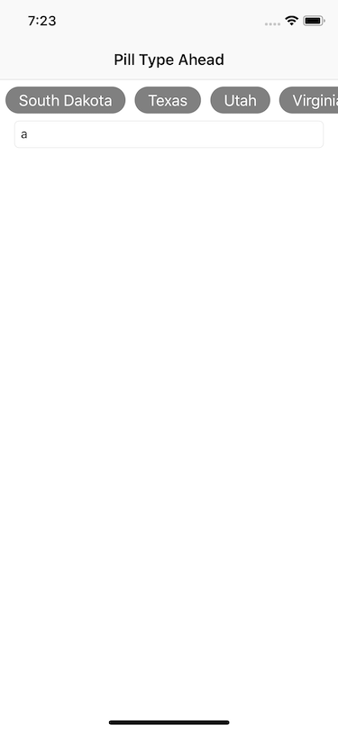

# TypeAheadWithPillViewController

An iOS Swift prototype for a text field with suggestions as you type that appear as a 
horizontally scrolling list of pill shapes with varying width.

Borrows quite a bit from [DGSelfSizingCollectionViewCells](https://github.com/danielgalasko/DGSelfSizingCollectionViewCells).

## Known Issues

- With long lists (~20+ items) the last item is cut off, probably due to a width miscalculation somewhere.
